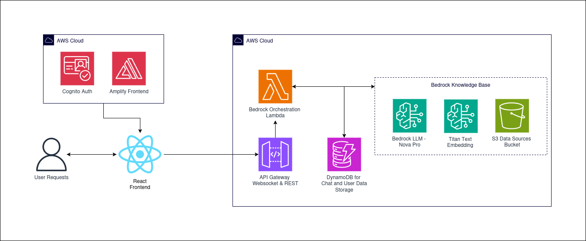

# Our Journey - Reentry Support Chatbot

A React-based frontend application for Our Journey's chatbot system, designed to guide people returning from incarceration in North Carolina through the reentry process with personalized, verified resources.

## Disclaimers

Customers are responsible for making their own independent assessment of the information in this document.

This document:

(a) is for informational purposes only,

(b) represents current AWS product offerings and practices, which are subject to change without notice, and

(c) does not create any commitments or assurances from AWS and its affiliates, suppliers or licensors. AWS products or services are provided "as is" without warranties, representations, or conditions of any kind, whether express or implied. The responsibilities and liabilities of AWS to its customers are controlled by AWS agreements, and this document is not part of, nor does it modify, any agreement between AWS and its customers.

(d) is not to be considered a recommendation or viewpoint of AWS

Additionally, all prototype code and associated assets should be considered:

(a) as-is and without warranties

(b) not suitable for production environments

(d) to include shortcuts in order to support rapid prototyping such as, but not limited to, relaxed authentication and authorization and a lack of strict adherence to security best practices

All work produced is open source. More information can be found in the GitHub repo.

## Table of Contents

- [Features](#features)
- [Architecture Overview](#architecture-overview)
- [Project Structure](#project-structure)
- [Backend Integration](#backend-integration)
- [Deployment](#deployment)
- [Supported Languages](#supported-languages)
- [Features in Detail](#features-in-detail)
- [User Guide](#user-guide)

## Features

### Journey Jones (JoJo) Chat UI
- **Interactive Chatbot**: 24/7 conversational interface to help users navigate reentry resources
- **Language Support**: English and Spanish
- **Personalized Recommendations**: AI-powered guidance based on individual circumstances
- **Resource Database**: Statewide verified resources for housing, employment, healthcare, and legal aid
- **User Data Collection**: Captures location, release date, demographics for personalized assistance
- **Safety Features**: Flags dangerous/self-harm questions for human follow-up
- **Contact Collection**: Prompts for email/phone when human intervention is needed
- **Session Management**: Maintains conversation context throughout the chat

## Architecture Overview

### System Architecture



The application uses a serverless architecture on AWS:

- **Frontend**: React application hosted on AWS Amplify
- **Backend**: AWS Lambda functions with WebSocket API Gateway
- **Knowledge Base**: AWS Bedrock Knowledge Base with verified NC reentry resources
- **Deployment**: Automated via AWS CDK

### Why This Architecture?

- **Stateless Lambda, Stateful Conversations**: Lambda functions are serverless for demand-based usage
- **AI-Powered Responses**: AWS Bedrock provides intelligent, context-aware answers
- **Reliable Resource Matching**: Knowledge base ensures users get verified, up-to-date information
- **Crisis Detection**: Built-in safeguards to identify users in need of immediate support
- **Scalable**: Handles varying traffic loads from individuals
- **AWS Native**: Works seamlessly with Amplify + API Gateway


## Project Structure

```
OurJourney/
├── setup.sh                                    # Main deployment orchestration script
├── frontend_build.sh                           # Frontend build automation script
├── bedrock.sh                                  # Bedrock knowledge base setup script
│
├── our-journey/                                # Backend CDK Stack
│   ├── app.py                                  # CDK app entry point
│   ├── cdk.json                                # CDK configuration
│   ├── requirements.txt                        # Python dependencies
│   ├── our_journey/
│   │   ├── __init__.py
│   │   └── our_journey_stack.py               # Backend infrastructure definition
│   │       # Creates: WebSocket API, Lambda, Bedrock Knowledge Base, S3
│   └── lambdas/
│       └── lambda_function/
│           └── lambda_function.py             # Bedrock orchestration Lambda
│
├── our-journey-frontend/                      # Frontend CDK Stack
│   ├── app.py                                 # CDK app entry point
│   ├── cdk.json                               # CDK configuration
│   ├── requirements.txt                       # Python dependencies
│   ├── build.zip                              # Generated by frontend_build.sh (gitignored)
│   │
│   ├── our_journey_frontend/
│   │   ├── __init__.py
│   │   └── our_journey_frontend_stack.py     # Frontend infrastructure definition
│   │       # Creates: S3 bucket, Lambda, Custom Resource for Amplify
│   │
│   ├── lambdas/
│   │   └── amplify_deployment_lambda/         # Amplify deployment automation
│   │       ├── lambda_function.py             # CloudFormation custom resource handler
│   │       ├── utilities.py                   # Amplify operations (create/update/delete)
│   │       └── constants.py                   # Configuration constants
│   │
│   └── frontend/                              # React/Vite application
│       ├── package.json                       # npm dependencies
│       ├── vite.config.js                     # Vite build configuration
│       ├── index.html                         # HTML entry point
│       │
│       ├── src/
│       │   ├── main.jsx                       # Application entry point
│       │   └── app/
│       │       └── components/
│       │           ├── constants_backup.jsx   # Template with REPLACE_TOKEN
│       │           └── constants.jsx          # Generated with WebSocket URL
│       │
│       ├── dist/                              # Build output (generated, gitignored)
│       │   └── index.html                     # Built application
│       └── node_modules/                      # npm packages (gitignored)
```


## Backend Integration

The application uses WebSocket connections for real-time streaming chat. All WebSocket interactions are in `src/app/services/websocket.js`.

### WebSocket Communication

**Connection**: `wss://your-api-gateway-url/prod/`

**Send Message**:
```json
{
  "action": "sendMessage",
  "message": "I need help finding housing",
  "messages": [
    {"role": "user", "content": "Previous message"},
    {"role": "assistant", "content": "Previous response"}
  ],
  "userInfo": {
    "location": "Durham, NC",
    "releaseDate": "2024-01-15",
    "gender": "prefer_not_to_say",
    "over18": true,
    "language": "en"
  }
}
```

**Streaming Response Types**:
```json
// Message start
{"type": "messageStart"}

// Content streaming (multiple deltas)
{"type": "contentBlockDelta", "data": {"delta": {"text": "I can help..."}}}

// Info/status updates
{"type": "info", "data": {"message": "Heres some resources..."}}

// Message complete (closes connection)
{"type": "messageStop"}
```

**Usage**:
```javascript
import webSocketManager from './services/websocket';

await webSocketManager.sendMessageAndWaitForResponse(
  userMessage,
  chatHistory,
  (content, isNewMessage) => updateUI(content, isNewMessage),
  (info) => showStatus(info),
  () => enableInput(),
  userInfo
);
```

## Deployment

### Prerequisites

Ensure you have access to the Nova Pro LLM model and Titan text embedding models in your AWS account, and permissions to deploy resources.

**Network Configuration**
- Default VPC available in your AWS region
- If default VPC doesn't exist, create using: [AWS VPC Documentation](https://docs.aws.amazon.com/cli/latest/reference/ec2/create-default-vpc.html)

### EC2 Instance Setup

1. **Navigate to EC2 Console**
   - Log into your AWS Console
   - Search for "EC2" in the services search bar
   - Click on "EC2" under Services

2. **Launch Instance**
   - Click "Launch Instance" button
   - Configure instance settings:
     - Name: "OurJourney-Deployment"
     - AMI: Amazon Linux 2023
     - Instance type: t2.micro (or larger)
     - Use default VPC configuration
   - Click "Launch Instance"
   - Wait for instance to reach "running" state

3. **Connect to Instance**
   - Navigate to the Instances page
   - Select your created instance
   - Click "Connect"
   - Use EC2 Instance Connect or SSH with username: `ec2-user`

> **Note**: Save your instance details for future management operations. This instance will be needed for updates and stack deletion.

### Install Required Packages

Execute the following commands in your EC2 terminal:

> **Note**: When password prompts appear, press Enter. Use Ctrl+Shift+V for terminal paste operations.

1. **Install Git**
   ```bash
   sudo yum install -y git
   ```

2. **Verify Installation**
   ```bash
   git --version
   ```

### Deployment Steps

1. **Clone the repository**:
   ```bash
   git clone https://github.com/ASUCICREPO/OurJourney
   ```

2. **Navigate to the project directory**:
   ```bash
   cd OurJourney
   ```

3. **Make the setup script executable**:
   ```bash
   chmod +x setup.sh
   ```

4. **Run the deployment script**:
   ```bash
   ./setup.sh deploy
   ```

5. **Enter your preferred admin email and password**

6. **Wait for the system to be deployed** (may take up to 30 minutes)

7. **View the application** at the deployed Amplify link, which can be found in the Amplify console page

8. **Stop the EC2 Instance**
   - Exit the EC2 instance
   - Navigate to EC2 console
   - Select your instance
   - Click "Instance state" → "Stop instance"

> **Important**: Keep the EC2 instance for future deployment management, updates, and deletion operations. Do not terminate the instance.


## Supported Languages

| Code | Language |
|------|----------|
| `en` | English (Default) |
| `es` | Spanish (Español) |

**Note**: Language selection affects all chatbot responses and UI elements.

## Features in Detail

### Chatbot Features

- **Resource Prioritization**: Our Journey resources shown first, followed by other verified NC resources
- **Personalized Guidance**: AI tailors responses based on user's location, release date, and needs
- **Crisis Detection**: Automatically identifies concerning language and prompts for help
- **Multi-step Collection**: Gathers user information progressively through conversation
- **Session Persistence**: Maintains context throughout the user's journey
- **Bilingual Support**: Full English and Spanish language support


## User Guide

### For Individuals Returning from Incarceration

1. **Starting a Conversation**:
   - Visit the Our Journey chatbot
   - Answer a few basic questions
   - Select English or Spanish
   - Say hello to Journey Jones (JoJo)
   - Answer initial questions about your situation

2. **Getting Help**:
   - Ask about housing, jobs, healthcare, or legal services
   - Mention your location (city or county in NC)
   - Be specific about your needs
   - JoJo will provide personalized resources

3. **Using Resources**:
   - Click on recommended resources for more details
   - Contact information is provided for each resource
   - Our Journey resources are prioritized

## Stack Management

### How to Delete the Stack

1. **Start EC2 Instance**
   - Navigate to EC2 console in AWS
   - Select the "OurJourney-Deployment" instance
   - Click "Instance state" → "Start instance"
   - Wait for instance to reach "running" state

2. **Connect to Instance**
   - Select your instance
   - Click "Connect"
   - Use EC2 Instance Connect

3. **Navigate to Project Directory**
   ```bash
   cd OurJourney
   ```

4. **Run Destroy Script**
   ```bash
   ./setup.sh destroy
   ```
   - Confirm deletion when prompted
   - Wait for stack deletion to complete

5. **Manual Cleanup (if needed)**
   - Navigate to AWS Bedrock console
   - Delete the Knowledge Base if it wasn't automatically removed
   - Navigate to Amplify console
   - Delete the application if it wasn't automatically removed

6. **Stop or Terminate EC2 Instance**
   - Once deletion is complete, you can terminate the EC2 instance
   - Navigate to EC2 console → Select instance → "Instance state" → "Terminate instance"

> **Note**: The destroy process removes Lambda functions, API Gateway, S3 buckets, and related resources. Some resources like Knowledge Base may require manual deletion.

### How to Update Resources

1. **Start EC2 Instance**
   - Restart the "OurJourney-Deployment" instance
   - Connect using EC2 Instance Connect

2. **Navigate to Project Directory**
   ```bash
   cd OurJourney
   ```

3. **Update Resource Files**
   - Modify files in the data/resources directory as needed
   - Ensure CSV format is maintained

4. **Redeploy with Updates**
   ```bash
   ./setup.sh update
   ```
   - The Knowledge Base will automatically sync with new data
   - Frontend will rebuild with any changes

5. **Stop EC2 Instance**
   - Exit and stop the instance when complete

> **Important**: Always maintain the EC2 instance for future updates and management. Terminating it will require a new instance setup for future operations.
